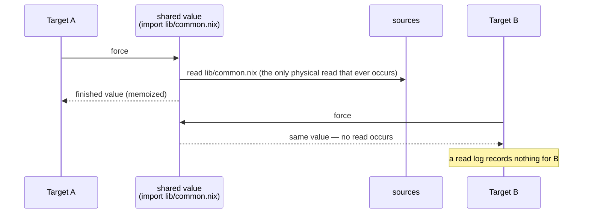
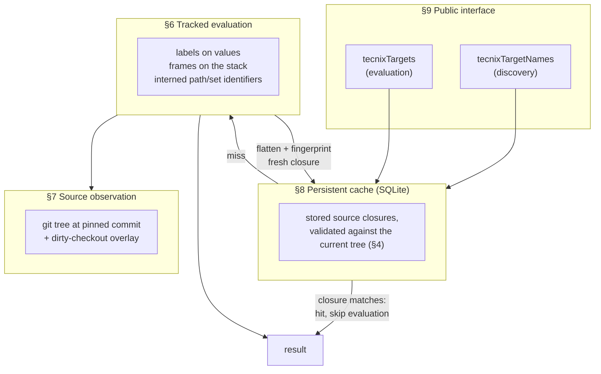
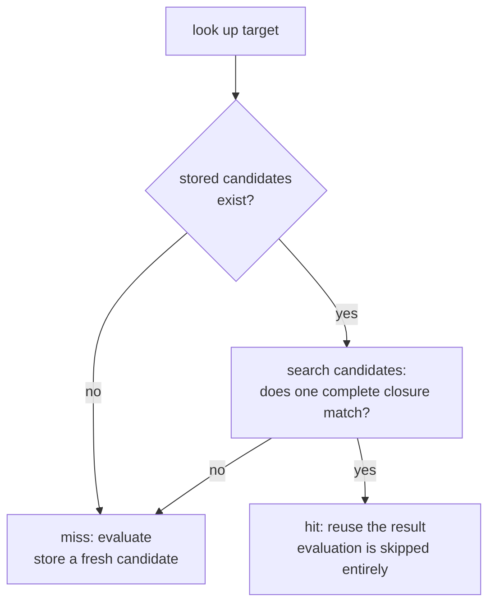
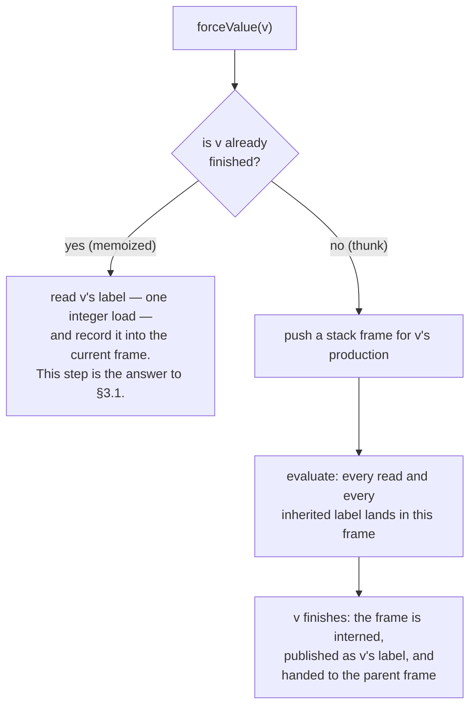
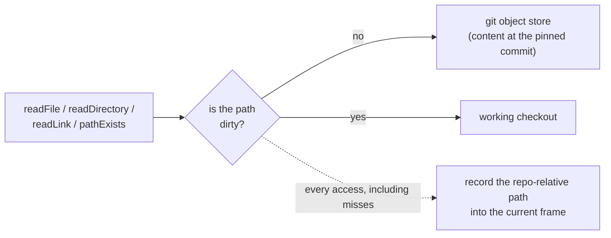

# Tecnix: Exact Target Dependencies and Cross-Commit Eval Caching

**Abstract.** Nix builds are input-addressed: a derivation's inputs are hashed, and identical inputs need never be rebuilt. Tecnix extends the same idea one level up, to evaluation itself. Each target's evaluation result is addressed by the content hashes of the source files that evaluation actually read — an artifact we call the target's *source closure*. The closure serves simultaneously as the target's exact dependency set and as a proof of cache validity: a stored result may be reused at *any* commit whose relevant sources still match, and must be recomputed at any commit where they do not. This document explains why that requires cooperation from the evaluator, how dependency information is threaded through Nix's lazy, memoized evaluation at near-zero cost, and how the resulting cache reduces warm evaluation time by orders of magnitude.

*Reading guide: users of the system need §§1–5 and §9. §§6–8 cover the evaluator internals. §10 concerns maintenance of the fork and may be skipped by everyone else. A glossary appears at the end. For the system in motion — one request traced from call to answer — see the companion document, 'The Life of a Target Evaluation'.*

---

## 1. The Problem

Consider a repository with many thousands of build targets. A developer changes one file. Which targets must CI re-test? Which merge-queue candidates actually conflict? Is anything in the developer's environment now stale? Today, answering any of these questions requires evaluating the repository's build logic — which is the very cost the answers were supposed to help avoid.

Two capabilities resolve this, and they turn out to be two views of one artifact:

**The target dependency graph.** For every target, the precise set of source paths on which its computed result depends:

```json
{ "//app/web:server": [ "app/web/target.nix", "lib/common.nix", ... ], ... }
```

**Target evaluation caching.** The ability to skip computing a target entirely when the sources it depends on have not changed.

A single requirement shapes the design: both must remain valid **across commits**. The system runs on every push, every merge-queue candidate, and every developer checkout after every pull. Dependency information tied to the commit that produced it would have little value; the value lies in reusing previous work against a new tree.

Exactness is equally fundamental, because dependency information is a substrate for many downstream decisions: precise test selection in CI, concurrent evaluation of merge-queue candidates, local staleness detection ("your development environment is stale after that pull — your `Gemfile.lock` changed"), and evaluation cheap enough that correctness can be verified on every invocation, in the manner of `bundle exec`.

### 1.1 Three ways to fail

It is useful to fix, at the outset, the three failure modes available to any design in this space. Every mechanism in this document exists to defend against one of them.

| failure | consequence |
|---|---|
| **Under-tracking** — a real dependency is missed | *Wrong answers.* A stale cached result is served as current. This is the fatal failure mode, and the design treats any instance of it as a correctness defect. |
| **Over-tracking** — spurious dependencies are included | *Useless answers.* If every target depends on everything, every commit invalidates everything; hit rates collapse and affected-sets balloon. Sound, but pointless. |
| **Slowness** — exact answers at impractical cost | *Unused answers.* The gold standard — evaluate each target in a fresh evaluator and log its reads — is exact and hopelessly slow. |

The labels of §6 defend against under-tracking; their per-value granularity — a target inherits only the production history of the values it actually touches — bounds over-tracking; nearly everything else defends against slowness.

One subproblem is contained within the problem. Before targets can be computed, the system must determine which targets *exist* — and in a monorepo the target list is itself derived from the source tree, so it is subject to the same staleness question as the targets. Discovery proves to be the same problem one level up, solved by the same machinery; it is treated in §9 alongside the public interface.

---

## 2. The Setting: Targets Are Programs

Targets in this repository are not declared in a static manifest. Their meaning is computed by Nix evaluation: repository code imports files, reads configuration, tests for the presence of optional overrides, and ultimately produces each target's result, which is a derivation.

### 2.1 Nix evaluation as a memoized value graph

The model on which the entire design rests is the following. Evaluating a Nix expression does not proceed from top to bottom. The evaluator lazily expands a graph of *thunks* (suspended computations) into *values*, on demand, and memoizes every result. A file is imported once; a shared helper is computed once; thousands of targets that use the same library all refer to the same finished value cells.

Tecnix's central move can now be stated in one sentence: **it records file accesses alongside this graph.** As the evaluator expands values, every source read, directory listing, and existence check is attached, in the form of a compact label, to the value whose production caused it. Dependency information thereby becomes part of the memoized graph itself and flows to consumers in exactly the way values do.

### 2.2 Why the mechanism belongs in the evaluator rather than in derivations

Nix already possesses an input-addressed caching mechanism: the derivation. A `.drv` file hashes its build inputs, so identical inputs yield identical builds. It is natural to ask whether this mechanism suffices.

It does not, because the derivation is the *output* of evaluation, not its input. Which derivation a target produces is determined by evaluation-time behavior — which files are imported, what `readFile` returns, whether `pathExists` finds an optional override — and none of these reads is recorded anywhere in the resulting derivation. Derivation-level caching answers the question "have these inputs been built before?"; it cannot answer "would evaluation produce the same derivation?". Answering the latter by evaluating is precisely the cost to be avoided.

Tecnix therefore makes evaluation itself input-addressed, with the source closure (§4) playing the role for evaluation that the input hash plays for builds.

Pure evaluation is load-bearing for this construction. The addressing is sound only if every input to evaluation flows through a channel that can be fingerprinted: the pinned git tree, the overlay of uncommitted changes, and the declared arguments. Impure evaluation may consult environment variables, the clock, or arbitrary filesystem paths, none of which a source closure can certify. The persistent cache therefore engages only under `pure-eval`. Impure evaluation continues to function and is still tracked within a run, but its results are never trusted across runs.

### 2.3 Design constraints

The implementation was required to satisfy the following constraints simultaneously; they recur throughout the document.

- **High performance.** Dependency evaluation over all targets must be practical, and warm runs must be faster than cold runs by orders of magnitude.
- **Approximately zero allocations during evaluation.** The tracking machinery executes inside the evaluator's innermost loop. Most of the techniques described below are, at bottom, allocation-avoidance techniques.
- **Minimal effect on parallel evaluation; minimal locking.** The parallel evaluator must continue to scale; tracking may not introduce contended locks on hot paths.
- **Simplicity.** Complexity is admitted only where it changes what the system can do. Speculative machinery is removed rather than retained.
- **Minimal invasiveness.** The codebase is a fork that merges upstream Nix regularly. The tracking system resides in its own module, and upstream files carry only a small, stable set of hooks.
- **Genericity.** The new builtins encode no knowledge of any repository's conventions. They operate on any git repository, which also permits correctness to be tested against small synthetic repositories, independently of the monorepo.

---

## 3. The Central Idea

### 3.1 Why simpler designs fail

Consider the obvious design first: while target *T* is being evaluated, log every file read. This design is defeated by memoization.



Target B depends on `lib/common.nix` in every meaningful sense: if that file changes, B's result may change. But B never touches the filesystem, because the graph already contains the answer. A per-target read log therefore under-tracks every target that arrives after the first — failure mode one, in its purest form.

The remedy follows directly from the model of §2.1. If values are the unit of sharing, then values must carry the dependency information:

```
a source read during the production of a value  →  the value receives a label
a target forces a value                         →  the target inherits the value's label
a target's dependencies                         →  the union of inherited labels
                                                   and its own direct reads
```

> **Why not…?**
>
> *…trace at the syscall layer (strace, fanotify)?* The same memoization argument applies — the read simply never happens for the second consumer — and syscall traces additionally cannot attribute a read to a *target*, only to a process.
>
> *…hash the whole repository as one input?* That is maximal over-tracking: every commit invalidates every target. Sound and useless (failure mode two).
>
> *…restrict what evaluation may read, and treat the allowed set as the dependency set?* Restriction is not attribution. Knowing what evaluation *may* read says nothing about what a particular target *did* read.
>
> *…isn't this flake evaluation caching?* Flake caching keys an entire evaluation by the hash of its locked inputs — all-or-nothing, and keyed by revision. Tecnix operates per target, and reuses results by validating content rather than trusting keys, which is what makes cross-commit reuse possible (§4.1).

### 3.2 The correctness contract

The design carries an executable specification, enforced by the test suite over deliberately adversarial sharing patterns:

> **Oracle.** Evaluating a target in isolation, in a shared evaluator, in a shared parallel evaluator, and answering from the warm cache must all yield identical dependency sets. Under-tracking and cross-target contamination are correctness defects, not performance trade-offs.

Because the builtins are generic (§2.3), the oracle is exercised against small synthetic git repositories constructed by the tests themselves. No monorepo is involved in verifying correctness.

### 3.3 The target-evaluation pipeline

The remainder of the document descends through the layers of Tecnix target evaluation and caching. It may help to hold the whole pipeline in view first:



---

## 4. Source Closures

The tracked output for a target is its **source closure**: the set of source paths that certify its evaluated result, each paired with a *fingerprint* of that path's current state.

A note on terminology: this use of "closure" is unrelated to the runtime closure of a store path. Here the word refers to the set of source files that close over an evaluation result — everything that could have influenced it.

```json
{
  "//app/web:server": {
    "app/web/target.nix":  "git:8a1f…;mode=100644",
    "lib/common.nix":      "git:03bc…;mode=100644",
    "app/web/vendor":      "git:77e2…;mode=040000",
    "app/web/local.nix":   "absent"
  }
}
```

Three properties of this structure deserve attention.

**Fingerprints are git-native.** The fingerprint of a clean path is its git object identifier plus the git file mode observed at that path. The object identifier is content-addressed and cheap to obtain from the repository; the mode is included because Nix source materialization observes executable bits even when file contents are unchanged. The fingerprint of a *directory* currently uses its tree object identifier and tree mode, which changes whenever anything beneath the directory changes; consequently, "the target listed this directory" is captured by a single record that remains conservatively correct. Uncommitted changes extend the fingerprint with a content hash of the modified files:

```
git:<sha>;mode=<mode>                  clean file or directory, at this commit's tree
git:<sha>;mode=<mode>;dirty=<sha256>   git base, plus a hash of uncommitted content beneath the path
absent                                 the path does not currently exist
absent;dirty=<sha256>                  no git object exists, but uncommitted content does
```

This path-level fingerprinting is intentionally conservative. There is room to refine the closure model from "this path's full fingerprint" toward "the specific property of this path that evaluation observed." For example, a directory listing depends on the complete child name/type map it returned — which also proves that no other child names were present — not necessarily on the full tree object ID or on every descendant's content. The current tree fingerprint is exact enough to avoid stale cache hits, but it can over-invalidate; a future closure format could record operation-specific observations such as existence, file type, executable bit, symlink target, directory child name/type sets, or file contents separately.

**Negative lookups are dependencies.** The entry `"app/web/local.nix": "absent"` records that evaluation checked for a file that was not present — an optional import, or a `pathExists` call. Should the file appear in a later tree, the closure ceases to match and the target is re-evaluated. Omitting this class of dependency is a classic source of staleness bugs; here it is a first-class citizen of the closure.

**The closure serves as the cache's proof of validity.** Validity is established by content, not by name, as the next section describes.

### 4.1 Cache reuse: validation rather than trust

The persistent cache stores bounded historical closure candidates for each target. The essential point is that rows are *not keyed by commit*. A cached answer is reused if and only if one complete stored candidate still matches the current tree — that is, if the current fingerprint of every path in that candidate equals the stored fingerprint:



This is the precise sense in which the system works across commits. After a commit, rebase, pull, or merge, any target whose relevant files are byte-identical in the new tree still has a matching closure, and its evaluation is skipped. A typical commit touches a small number of paths in a very large repository, so a typical warm run validates nearly everything and re-evaluates nearly nothing. The cache follows content rather than history — the evaluation-side analogue of the input-addressed builds discussed in §2.2.

The same property makes the system fail-safe. A row is never believed on the strength of its key; it is believed only when proven. Format changes, corruption, and storage defects therefore all degrade into cache misses, never into wrong answers. In practice, the difference between a cold run and a warm run is the difference between roughly a minute of full tracked evaluation and well under a second — several orders of magnitude, with the gap consisting precisely of "all of evaluation" versus "fingerprint checks and output construction."

---

## 5. A Worked Example

Consider a small synthetic repository, of the kind the correctness suite itself constructs. The directory `build/resolver/` contains the repository's target-definition entry point, called the *resolver*; its contract is given in §9.

```
repo/
├── build/resolver/resolve.nix     # enumerates and evaluates this repo's targets
├── services/
│   ├── api/target.nix             # defines //services/api
│   └── web/target.nix             # defines //services/web
└── lib/util.nix                   # imported by api only
```

**Run 1, cold, at commit C₁.** Discovery evaluates the resolver, which lists `services/` and reads each `target.nix` to enumerate targets. Evaluating `//services/api` imports its `target.nix`, which in turn imports `lib/util.nix` and probes for `services/api/local.nix`, an optional override that is not present. All of this is recorded:

```
discovery closure:        build/resolver/resolve.nix → git:…;mode=100644,  services → git:…;mode=040000,
                          services/api/target.nix → git:…;mode=100644,  services/web/target.nix → git:…;mode=100644
//services/api closure:   services/api/target.nix → git:…;mode=100644,  lib/util.nix → git:…;mode=100644,
                          services/api/local.nix → absent
//services/web closure:   services/web/target.nix → git:…;mode=100644
```

Subsequent runs, one commit each:

| commit | change | discovery | `//services/api` | `//services/web` |
|---|---|---|---|---|
| C₂ | edit `lib/util.nix` | **hit** — closure doesn't mention it | **miss** — `lib/util.nix` fingerprint stale; re-evaluated | **hit** |
| C₃ | add `services/api/local.nix` | **hit** | **miss** — `absent` entry no longer matches; re-evaluated, now reading the override | **hit** |
| C₄ | edit `README.md` only | **hit** | **hit** | **hit** |

C₃ deserves emphasis: a *newly created* file correctly invalidated a target that had merely *looked for* it — the negative-lookup machinery operating as designed. And C₄ shows the steady state: a run whose cost is fingerprint validation and nothing more, independent of repository size or target count.

---

## 6. How Labels Propagate Through the Value Graph

This section descends one level, to the mechanics of attaching and propagating labels, and to the reasons the mechanism is nearly free.

### 6.1 A label is one integer

Storing a set of path strings on every Nix value would be prohibitively expensive in both memory and time. Instead, paths and *sets of paths* are interned into 32-bit identifiers in a per-evaluator, append-only structure:

```
"lib/util.nix"        → AccessId 7        (interned once, on first sight)
{7}                   → AccessSetId 3     (canonical: equal sets share one ID)
{7, 9}                → AccessSetId 5
union(3, {9})         → 5                 (resolved by a small pair-keyed cache)
```

A value's label is thus a single `uint32_t`. Comparing labels is integer comparison; inheriting a label is copying an integer; and taking the union of two labels is a cache lookup keyed by the pair of identifiers. This last case dominates because lazy evaluation overwhelmingly combines exactly two labels at a time, and evaluation is repetitive enough that the same pairs recur constantly.

The label is stored not in the value itself but in a sparse two-level table keyed by the cell's address: a small constant-initialized directory pointing at demand-paged chunks, one 32-bit slot per 16-byte-aligned cell. `Value` keeps its exact upstream size and layout — a `static_assert` enforces this — and the table's physical footprint is proportional to use: a chunk is allocated only by the first labeled value in its address region, so evaluation that never tracks pays nothing, and tracked evaluation pays about four bytes per value cell. The directory's hot entries cover the entire heap in a handful of cache lines, so reading a label is address arithmetic and two loads.

### 6.2 The force path: where memoization is answered

`forceValue` is the innermost operation of the evaluator. When tracking is inactive, Tecnix adds a single thread-local read and a well-predicted branch to it. When tracking is active, the behavior is easiest to see in a concrete trace. Suppose a target's thunk imports a library file:

```
force lib thunk          frame F₁ opens
  read lib/util.nix      AccessId 7 recorded in F₁
lib finishes             F₁ interned → SetId 3 = {7};  lib.label ← 3
force target thunk       frame F₂ opens
  force lib (finished)   lib.label (3) recorded in F₂     ← inheritance: no read occurs
  read app/target.nix    AccessId 9 recorded in F₂
target finishes          F₂ interned → SetId 5 = {7, 9};  target.label ← 5
```

The general shape:



A **frame** is a small accumulator on the call stack, holding the identifiers of directly-read paths and the labels inherited from forced values. Frames nest with evaluation, forming a stack per thread. When a value finishes, its frame is interned and the resulting set identifier is published as part of the finish operation itself, ordered such that the label is guaranteed visible to other threads before the value appears finished; no consumer can observe a finished value whose label is missing.

A small number of hooks at the evaluator's value-mutation points maintain the labels' single invariant: *a label describes a cell's current contents, never its history.* Every cell becomes a finished value through a single chokepoint, and the label slot is cleared there unconditionally — whatever the slot held for a previous occupant of that address (a recycled heap cell, a reused stack slot), a finished value starts empty and receives its label from the publish that follows. Unconditional clearing at the one point every finished value passes through is what guarantees that a label is always either empty or accurate. Value copies propagate labels, so provenance survives the evaluator's pervasive movement of values between cells: force, call-time capture, and copy are indistinguishable channels, and contents never move without their label.

### 6.3 Scopes: labels for work the evaluator caches

Some provenance is produced in one place and consumed from a cache. The evaluator memoizes more than values: a file is evaluated once and its result cached; an import path is resolved once — through symlinks and `default.nix` selection — and the resolution cached; the resolver is imported once and applied to every target. On a cache hit, the reads that produced the cached artifact do not recur, so the artifact itself must carry them.

A **scope** is the bracket that makes this work: a region of evaluation — the evaluation of a file, the resolution of an import, the import of the resolver, or a region marked by internal builtins — whose collected accesses are interned into a single set identifier when the region closes. That identifier is published as the produced value's label (or stored beside the cache entry, for caches that do not store values), so a later hit replays the provenance through ordinary label inheritance, exactly as if the consumer had performed the production itself. The resolver's scope label is additionally seeded into every target's context, so every target depends on the resolver's own sources without importing it repeatedly.

This is one instance of the general rule of §7: any cache capable of skipping a physical read must replay the provenance of that read.

### 6.4 The cost discipline: approximately zero allocations, approximately zero locks

The tracking hot path is held to an explicit invariant:

> Recording, forcing, and publishing allocate memory only on the first sight of a path or set — never on a hit.

In the steady state, this cashes out as follows. Recording an access is a lock-free hash lookup on a borrowed view of a path string the accessor already holds; no string is constructed. Frames live on the stack, with small inline storage sized to the empirically measured distribution (nearly all frames hold between zero and two entries). Publishing an empty frame touches nothing, and publishing a frame with a single inherited child reuses the child's identifier without consulting the graph at all. Label reads are address arithmetic into the value-label table, whose hot directory entries and quarter-density slot lines stay cache-resident.

One mutex remains, and it is worth being precise about what it covers. The interning graph's single global mutex guards first-sight path interning and every publish that must actually consult the graph: singleton lookup, pair-union lookup — *including hits* — and full set interning, as well as the per-target flatten at finalization. This is the system's one global serialization point, and therefore its most plausible parallel-scaling bottleneck. Two properties bound it. First, the critical sections are tiny — a hash probe or a small append. Second, its acquisition frequency is proportional to thunks that finish having accumulated real dependencies (one direct access, or two or more inherited children), not to total forces; the empty and single-child fast paths drain the overwhelming majority of publishes before the lock. Should measurement ever show contention here, the structures are append-only by design, so the known remedies — per-thread intern memos, sharded intern maps, lock-free readers over atomically published sizes, a thread-local cache in front of the pair-union table — can be applied without changing the model.

Process-level parallelism sidesteps this analysis entirely, and for large all-target runs it is likely the better scaling axis. A `nix-eval-jobs`-style driver that shards targets across independent evaluator processes gives each worker its own interning graph — and its own mutex — so no global serialization point exists at any worker count; the cost is that values shared between targets (the standard library, common helpers) are evaluated once per process rather than once overall. The oracle of §3.2 is what makes this sound: closures are identical across evaluation modes, so a target's closure does not depend on which process produced it, and the processes can share one persistent cache because rows are validated by content, never by producer.

Parallel evaluation receives a stronger treatment: **tracking contexts are thread-confined.** Each parallel work item that evaluates a target owns its context outright — created, recorded into, snapshotted, and destroyed on one thread — so recording never locks and no frame is ever shared between threads. The only cross-thread dependency channel is the published label on a finished value. Tracked evaluation is therefore forbidden from spawning parallel work of its own: the evaluator's detached prefetch sites (`toJSON`'s deep force, `builtins.parallel`) skip prefetching under tracking — the consumer forces sequentially, producing identical results — and the work-item factory fails loudly if anything else tries, because a work item may capture only owned state and a tracking context is a non-owning pointer into another thread's stack. The comparatively expensive step — flattening identifier sets into paths and fingerprinting them — is deferred until all work items have finished, at which point it is a pure function of the recorded snapshots. This is why sequential and parallel evaluation produce identical closures, and why the oracle of §3.2 may legitimately demand that they do.

---

## 7. Observing the Sources

All tracked reads flow through a single source accessor that composes the git tree at the pinned commit with the working checkout. Routing between the two is decided by a set of dirty files computed once per evaluation from `git status`:



Clean paths are served from git's object store — no checkout is required, and evaluation can run against a bare repository. Dirty paths are served from disk. Every access records the repository-relative path. Existence checks are recorded at the primop layer (`pathExists`, `readFileType`), which is how negative lookups enter the closure despite no read occurring.

In a worldtree sandbox (`tectonix-worldtree-socket` set) there is no git repository to read; the clean tree is instead the daemon's immutable FUSE projection of the pinned commit, with repo-relative paths mapped through the committed manifest to per-zone views. The fingerprint vocabulary is unchanged: directories read their exact committed tree oid from the projection's `user.worldtree.tree-oid` xattr, and regular files read the daemon's `user.worldtree.blob-oid` xattr when it is served — one O(1) metadata read each. Symlinks (which cannot carry user xattrs; `getxattr` would follow the link and answer for its target, a different git object) and files under daemons that do not serve blob oids fall back to hashing their bytes as git blobs — a blob oid is a pure function of content — memoized in memory for the accessor's lifetime, which the immutable projection makes sound: each unique file is hashed at most once per evaluation. Because every mechanism emits identical fingerprint strings, closures produced under one backend validate under the other. Two caveats follow from the projection being zone-granular: committed paths outside every visible zone do not exist in this view and observe as `absent`, and zone-ancestor directories are synthesized with a composite `worldtree-union:` fingerprint outside the git vocabulary (their listing genuinely differs from the full git tree, so cross-backend cache misses there are correct, not conservative).

The evaluator's own caches require care, since any of them could silently absorb a read. Each — the file-evaluation cache, the import-resolution cache, the source-to-store copy cache — either maintains a separate tracked-domain instance or replays its provenance on a hit. The general rule: *any cache capable of skipping a physical read must replay the provenance of that read.*

The failure policy throughout is to fail closed. If `git status` fails, evaluation raises an error rather than assuming a clean tree, because the dirty overlay is load-bearing for closure validity. If a path cannot be fingerprinted, evaluation raises an error rather than emitting a partial closure. If evaluation reaches something the closure format cannot represent, it raises an error rather than under-tracking. Every failure mode resolves to a cache miss or a visible error; none resolves to a plausible wrong answer.

---

## 8. The Persistent Cache

The cache is a single SQLite database with one physical row family:

```
DependencyShards(gitDir, resolver, argsKey, shard → multi-target history blob)
```

Target discovery (§9) is stored in the same rows, under a reserved key whose candidates carry the discovered target list as a payload; discovery thereby shares the lookup, validation, history, and compaction machinery of ordinary targets rather than maintaining a parallel implementation. The key contains no commit. The `argsKey` column holds the canonical JSON encoding of the caller's `args` value; this is sound as a key because the resolver receives that same value, so results can depend on the arguments only through content that is, by construction, the key.[^ambient-inputs] Validity across trees is established entirely by the closure-matching procedure of §4.1.

[^ambient-inputs]: Ambient inputs that a pure evaluation can still observe — `builtins.nixVersion`, the store directory — are deliberately *not* part of the cache key. This aligns with Nix's existing flake evaluation cache, whose key is likewise content-only. Changes to the evaluator itself, or to Tecnix semantics, are instead handled by bumping the version in the cache's filename (`tecnix-eval-cache-v1.sqlite`), which orphans old rows wholesale rather than mixing results from two evaluator versions in one database.

A dependency shard row is therefore a physical container for many bounded per-target proof histories, not a log indexed by commits. Each target candidate in that history is a complete source closure: a map from observed source paths to the fingerprints they had when the target was evaluated. A cache hit means that one whole candidate for that target still matches the current tree. The commit at which the candidate was learned may be useful metadata for ordering or eviction, but it is never proof of validity.

Sharding is a row-size compromise. With `N` targets, `S` shards, and an average source closure of `P` path/fingerprint pairs, the newest-candidate pair payload in a shard is roughly `(N / S) * P` pair records, plus shared dictionaries. Fewer shards improve dictionary sharing and reduce all-target row count, but make each row larger and make each update rewrite more unrelated target history. More shards make point lookup and update rows smaller, but duplicate side tables and increase all-target row overhead. On the measured 7,254-target `aarch64-darwin` workload, the average closure is about 187 path entries; with 256 shards, one-candidate rows average about 79 KiB and max at about 120 KiB, for about 20 MiB total. That is small enough for fast all-target warm lookup while still sharing path and fingerprint strings across many targets. The shard count should move only with measurement; values in the 128–256 range are the plausible region for this workload, while larger counts mostly trade row size for duplicated dictionaries.

The first implementation deliberately uses flat newest-first candidate history rather than a decision trie. The common case is that the latest candidate still matches, and the history bound is small. In that case, a trie adds another index to build, validate, and explain without reducing the expensive part of validation: computing the current fingerprint once per unique path. The per-run fingerprint memo already makes repeated path checks cheap. A trie over `(pathId, fingerprintId)` predicates could become worthwhile if measurements show many stale candidates per hot target and repeated pair scans dominate warm lookup, but it is not needed for the initial sharded blob design.

Dependency and discovery blobs begin with the magic bytes `TXDC` (for "TecniX Dependency Closure"). The magic serves as the format's self-identifier: foreign, corrupted, or out-of-date blobs are rejected immediately, and rejection is a cache miss rather than an error. The blob bytes are laid out so they are already the data structure used by validation:

```
header:       TXDC magic, fixed format marker, counts, section offsets
targets:      offset table + concatenated target identifiers
targetRecords: candidate range for each target
paths:        offset table + concatenated repo-relative path bytes
fingerprints: offset table + concatenated fingerprint bytes
payloads:     offset table + candidate payload bytes
candidates:   pair-stream range + payload id for each historical candidate
pairs:        flat (path id, fingerprint id) streams for validation and output
```

Each candidate record is one complete historical source closure. Validation searches a target's candidates newest-first. For each pair in a candidate, it asks whether the current fingerprint of that path equals the stored fingerprint. If every pair matches, that candidate is a cache hit and its pair stream is walked directly to construct dependency output. For target discovery, the matching candidate also carries the target-list payload.

Opening a blob is just bounds-checking the section offsets, counts, and ranges, then viewing the arrays in place. There is no JSON parse for dependencies, no heap object graph, no pointer patching, and no decoded index to build before lookup can begin. Bulk queries load all relevant shard rows in a single range scan and search the requested target histories outside the database lock. The search is lazy: it fingerprints a source path only when the candidate currently being checked asks about that path, and a per-run memo eliminates repeated fingerprint computations for paths shared between shards, candidates, and targets. A warm hit thus bypasses the entire tracked-evaluation stack, paying only for shard loading, candidate scanning, fingerprint comparison, and output construction.

### 8.1 Cache history and lifecycle

The cache keeps **bounded historical source closures, not per-commit entries.** The target scale is enough recent history to cover ordinary branch switching and merge-queue churn — on the order of 10–32 historical evals — while keeping lookup fast. The current bound is chosen roughly as the number of distinct source-closure changes a hot target might see in about 24 hours, not as a function of commits per day. Reuse across commits still comes from re-proving a candidate closure against the current tree, not from trusting the commit that produced it.

A fixed candidate count is the simplest first policy. If measurements show that useful histories are mostly time-shaped rather than count-shaped, a future cache could retain candidates by an approximate 24-hour TTL instead: keep all distinct closures learned in the recent window, then evict by age. That would trade a slightly less predictable row size for a policy closer to the product goal of surviving normal daily branch and merge-queue churn.

Consequently, the cache grows with the logical key space and the bounded history per target, not with repository history. A target's history lives inside the `DependencyShards` row selected by `(gitDir, resolver, argsKey, shard)`, where the shard is a stable hash of the target name; discovery history lives under a reserved key in the same scheme. Within a target history, inserting a freshly evaluated closure deduplicates identical closure content and evicts old candidates by policy when the bound is reached.

The important behavioral consequence is that switching between divergent trees need not thrash the cache. If two branches produce different but recently seen closures for the same target, both can remain as candidates, and either branch can hit by proving its candidate against the current tree. If the useful candidate has been evicted, the result is only a cold re-evaluation; eviction is a performance policy, not a correctness policy.

The unbounded dimensions are the key tuples themselves: each distinct `args` value, resolver path, or repository location materializes its own row set, and abandoned tuples are not currently reclaimed. The validation discipline supplies the operational escape hatch: since no row is ever trusted without proof against the current tree, the database is disposable. Deleting it is always safe and costs cold re-evaluation.

---

## 9. The Public Interface, and the Discovery Subproblem

Constructing the dependency graph presupposes an answer to a prior question: which targets exist? The target list is not a manifest; it emerges from evaluating repository code that walks directories and reads definition files. Discovery is therefore the same kind of computation as target evaluation — Nix evaluation reading the repository — and it is handled identically. Discovery acquires its own source closure, comprising the paths that determine the target list, including the negative space in which no definitions were found; and it is cached under the same validation discipline, in the same rows as target closures, under a reserved discovery key (§8). If a new target definition appears anywhere discovery looked, the closure ceases to match and discovery re-runs; otherwise, a previously computed target list is provably still current.

The public interface accordingly consists of two builtins, one per problem:

```nix
# Discovery: which targets exist?
builtins.tecnixTargetNames {
  gitDir = "/path/to/repo/.git";
  resolver = "build/resolver/resolve.nix";   # repo-relative resolver file
  rev = "<commit>";
  args = { systems = [ "x86_64-linux" ]; };   # opaque; must be JSON-canonicalizable
}
# → [ "opaque-target-id" ... ]

# Evaluation: what do these targets mean, and what do they depend on?
builtins.tecnixTargets {
  ... same ...;
  targets = [ "opaque-target-id" ];
  includeDependencies = true;       # optional: also return source closures
}
```

The entire contract between Tecnix and a repository is one file, the **resolver**. The simplest possible resolver makes the contract plain — real resolvers derive the same structure from the source tree:

```nix
# build/resolver/resolve.nix — evaluates to a function over the caller's args
args:
let
  targets = {
    "//services/api" = import ../../services/api/target.nix { inherit args; };
    "//services/web" = import ../../services/web/target.nix { inherit args; };
  };
in {
  allTargetNames = builtins.attrNames targets;   # discovery
  resolve = id: targets.${id};                   # evaluation (values expose a drvPath)
}
```

Target-identifier syntax, naming conventions, and indeed the very notion of what constitutes a target are decisions belonging to the resolver, not to Tecnix. The engine understands only two operations: arguments in, identifiers out; and identifier in, evaluated value and source closure out. This genericity is deliberate. It makes the machinery applicable to any git repository, and it is what allows the correctness suite to construct small, disposable repositories — such as the one in §5 — and hold the oracle against them.

The older, repository-specific builtins (the `unsafeTectonixInternal*` family) remain available for existing consumers. They are intentionally quarantined in a separate source file, are deprecated, and are expected to be removed once their consumers migrate. Those among them that expose checkout-local state refuse to run under tracking, in keeping with the fail-closed policy.

---

## 10. Minimal Invasiveness

*This section concerns the maintenance of the fork itself and may be skipped by readers interested only in the system's behavior.*

The codebase merges upstream Nix on a regular basis, which makes the merge-conflict surface of upstream files a first-order maintenance cost. The patch is shaped accordingly: the tracking system resides in its own module, and upstream files carry only narrow, stable hooks.

| upstream file | contents |
|---|---|
| `value.hh` | three one-line hooks at the finish and copy-assignment points; no members added |
| `eval.hh` | a five-line dispatch shim in `forceValue`; work-item context capture; one private data member (the file is smaller, net, than its upstream counterpart) |
| `eval.cc` | cache-domain selection in `evalFile`; one provenance record in `copyPathToStore` |
| `primops.cc` | two one-line existence-check records |
| libutil / libfetchers | a small, generic "access observation" accessor interface |

Everything else — the interning structure, the frames, the accessors, the cache, and the builtins — is module-local and unaffected by upstream merges. The module carries no exploratory scaffolding: no tuning knobs, per-call-site instrumentation, or speculative API variants. The working rule is that no optimization is admitted without a profile measurement attributing cost to it, and no complexity without a measured improvement; questions of timing are answered by a profiler rather than by permanent counters.

---

## 11. Limitations

The following limitations are deliberate and documented. The persistent cache requires `pure-eval` (§2.2). Dirty-file state is captured once per evaluation, so mutating the checkout during a query is outside the contract. Access to the repository root is not representable in the closure format and fails closed. The cache has no key-tuple eviction policy; abandoned `(gitDir, resolver, argsKey)` row sets accumulate until the database is deleted, which is always safe (§8.1).

**Future work.** In a worldtree sandbox, directory and regular-file fingerprints are already single O(1) xattr reads when the daemon serves `user.worldtree.blob-oid` beside `user.worldtree.tree-oid` (§7). The remaining hash fallback covers symlinks — which cannot carry user xattrs at all — and daemons that predate the blob-oid xattr; it is memoized in memory per evaluation. A daemon-side answer for symlink oids (for example serving the parent's raw tree object, whose `(mode, name, oid)` entries are exactly what libgit2 itself reads) would delete the fallback entirely; because every mechanism emits identical fingerprint strings, that change invalidates no stored closure. Additionally, the projection is zone-granular: committed paths outside every visible zone are not observable historically, and mutable-sandbox dirty discovery still assumes a local `git status`, whose worldtree replacement is the daemon's `scoped.status`.

---

## Glossary

| term | meaning |
|---|---|
| **source closure** | the set of source paths, with fingerprints, that certify one evaluation result; unrelated to a store path's runtime closure |
| **fingerprint** | a path's current observed state: a git object ID plus git mode, optionally extended with a hash of uncommitted changes, or `absent` |
| **label** | the compact identifier, carried on a value, naming the set of source paths that produced the value's current contents |
| **frame** | a stack-resident accumulator collecting the reads and inherited labels of one value's production |
| **scope** | a bracketed evaluation region whose collected accesses are interned once and published as the produced value's label; how provenance replays through the evaluator's caches |
| **resolver** | the repository-owned Nix function defining discovery (`allTargetNames`) and evaluation (`resolve`) |
| **discovery** | determining which targets exist; the same tracked, cached computation as target evaluation, one level up |
| **negative lookup** | an observed *absence* (e.g. `pathExists` returning false), recorded as a dependency so a new file invalidates correctly |
| **TXDC** | the magic bytes ("TecniX Dependency Closure") identifying the binary closure format in the cache |

---

## Appendix: The System in Summary

```
Goal:      the exact target dependency graph, and the ability to skip target
           evaluation across commits.
Setting:   Nix evaluation is a lazily-expanded, memoized graph of values; the
           derivation is its output, so evaluation itself must be made
           input-addressed by the sources it reads. Pure evaluation is what
           makes that addressing sound.
Mechanism: file accesses are recorded alongside the value graph as labels on
           values; targets inherit labels from every value they force, so
           memoization cannot conceal a dependency.
Product:   a target's label set, fingerprinted, is its source closure —
           including directories listed and files found absent.
Caching:   a stored closure that still matches the tree proves a cached result
           valid, at any commit. Discovery is the same problem one level up:
           the target list has a closure too.
Cost:      interned integers, stack frames, lock-free hits, and no allocations
           on the hot path; validation everywhere, trust nowhere.
```
