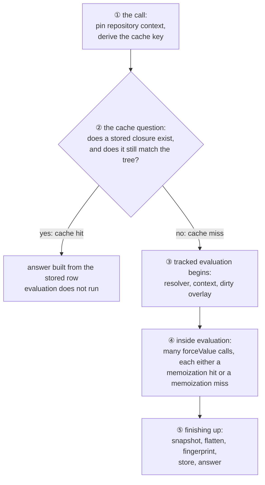
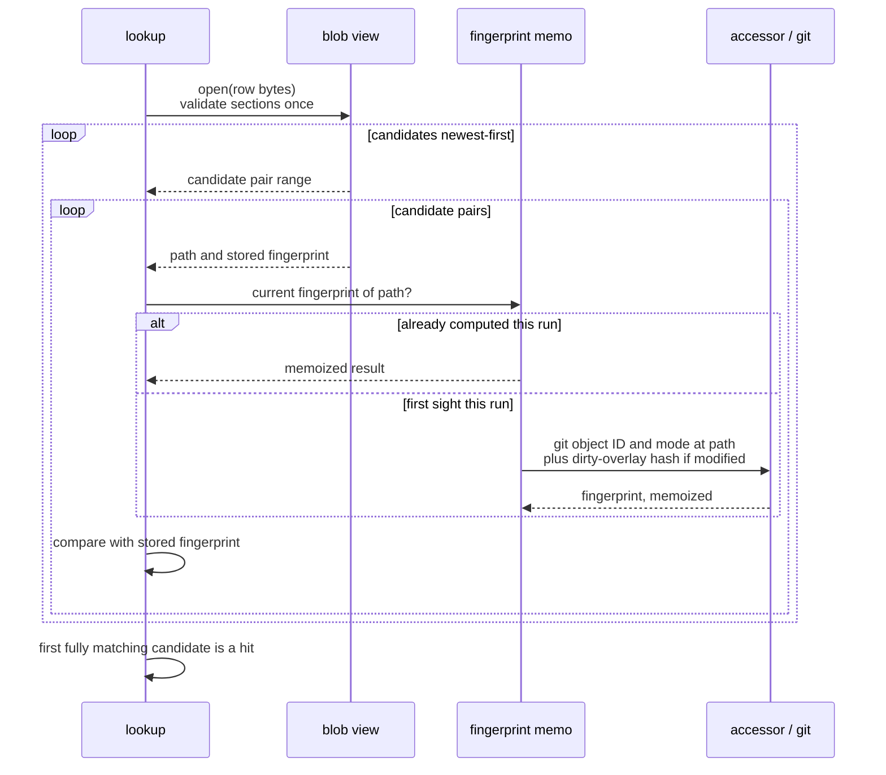
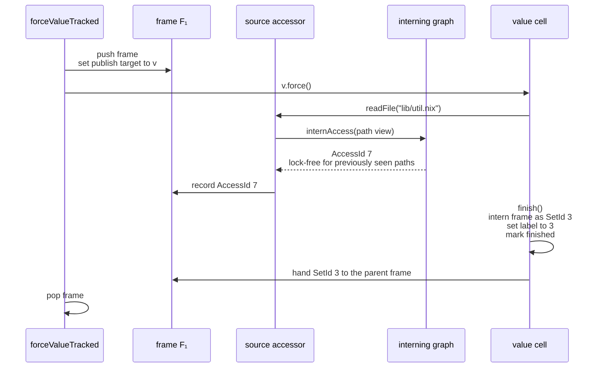

# The Life of a Target Evaluation

*A step-by-step trace through Tecnix.*

*This document is a companion to the explainer ("Tecnix: Exact Target Dependencies and Cross-Commit Eval Caching"). Where the explainer describes the system at rest — the problem, the design, and the structures — this document describes it in motion: a caller asks Tecnix to evaluate one target, and we follow the request from the builtin call to the answer. Each data structure is introduced at the point where it first participates, together with the reason it exists and its cost at that moment.*

*We assume the target's identifier is already known. Discovery (`tecnixTargetNames`) travels the identical road — the same cache question, the same tracked evaluation, the same closure — with the target list as its result rather than a target's value. The example repository throughout is the same synthetic repository as the explainer's §5 worked example.*

---

## 1. The Goal

Consider the following call:

```nix
builtins.tecnixTargets {
  gitDir = "/path/to/repo/.git";
  resolver = "build/resolver/resolve.nix";
  rev = "<commit>";
  args = { systems = [ "x86_64-linux" ]; };
  targets = [ "//services/api" ];
  includeDependencies = true;
}
```

The caller expects two things in return: the target's **evaluated value**, and its **source closure** — the fingerprinted set of paths that certify the result, including directories that were listed and files that were found absent. The caller further expects the call to be inexpensive whenever nothing relevant has changed, even if the current commit differs from the one at which the target was last evaluated.

## 2. The Journey at a Glance

Every request follows the same path, which contains two significant branch points. The numbered stations correspond to Steps ① through ⑤ in the sections that follow:



The first branch — cache hit or miss — determines whether evaluation runs at all. The second branch is taken a very large number of times *within* evaluation: each time a value is demanded, it has either been computed already (a memoization hit) or it has not (a memoization miss). The remainder of this document walks the path in order. At each branch we take the expensive side, so that every mechanism is visited, and we note what the inexpensive side would have cost instead.

## 3. Step ①: The Call

Argument handling is largely routine. Two decisions made at this stage matter later.

First, **the repository context is pinned.** The `gitDir`, `rev`, and checkout path configure the evaluator's source accessors, and they do so exactly once per evaluator instance. A second call with a different `rev` produces an error rather than a silent reconfiguration. The reason is that the accessors, fingerprints, and cached content constructed downstream are all built lazily against a single commit; permitting reconfiguration would allow content from two commits to mix without any indication that it had.

Second, **the `args` value becomes part of the cache key.** It is converted to a canonical JSON encoding, called the `argsKey`. This is sound because the resolver receives the same value: results can depend on the arguments only through content that is, by construction, the key. It is worth observing what the cache key does *not* contain: the commit. Validity across commits is established by proof rather than by key, as the next step describes.

## 4. Step ②: The Cache Question

> **Structure: `TecnixEvalCache`.** A SQLite database holding shard rows keyed by `(gitDir, resolver, argsKey, shard)`. Each shard row contains bounded source-closure histories for the targets assigned to that shard. It exists because skipping evaluation requires remembering what would certify the skipped result.

The shard containing `//services/api` is loaded. A single target uses a point lookup for its shard; when many targets are requested, one range scan retrieves the relevant shard rows, and their validation proceeds outside the database lock. Each row's blob begins with the magic bytes `TXDC` (explainer §8).

> **Structure: the `TXDC` blob and its `DependencyBlobView`.** The blob is not a serialization that is parsed into objects; it is itself the data structure. Opening a view validates every section, offset, and range once. The view then exposes target, path, fingerprint, and payload dictionaries plus flat candidate and pair records as borrowed spans over the row's own bytes. A malformed or out-of-date row fails to open and is treated as a cache miss rather than an error.

Validation checks historical candidates newest-first until one complete closure still matches the current tree:



> **Structure: the per-run fingerprint memo.** A thread-local table from path to current fingerprint. It exists because the closures of many targets, and the historical candidates for one target, share most of their paths; each unique path is fingerprinted once per run — a git object-identifier and file-mode read, which is itself inexpensive — and every subsequent occurrence is a hash lookup. Validation cost therefore scales with the number of *unique* paths candidate scanning asks about, not with the total number of historical closure entries. (In a worldtree sandbox the clean tree is the daemon's immutable FUSE projection rather than a git repository: directory fingerprints come from a tree-oid xattr, and regular-file fingerprints from a blob-oid xattr when the daemon serves one, falling back to hashing content as a git blob, memoized in memory for the run — identical fingerprint strings, identical validation; see the explainer's §7.)

If one candidate fully matches, the journey ends here: that candidate identifies the matching historical closure, the output is built directly from its pair stream, and everything described in the remaining sections is skipped — the resolver, every force, every frame, all interning. This asymmetry accounts for the difference of several orders of magnitude between warm and cold runs. The `absent` entries participate in the search as well: a path that the target once probed and did not find is checked to still be absent, so a newly created file fails the proof in exactly the way an edited one does.

For the purposes of this walkthrough, suppose no complete candidate matches. The lookup is a miss, and evaluation must run — under observation.

## 5. Step ③: Tracked Evaluation Begins

> **Structure: `TrackingContext`.** One per target, owning a root accumulator. It exists so that each target's dependencies remain isolated from those of every other target sharing the evaluator.
>
> **Structure: `TecnixThreadState`.** A single thread-local record holding the active context, the top of the frame stack, and the current publish target. It exists so that tracking state is reachable from the evaluator's innermost loop at the cost of one thread-local access, without threading arguments through upstream code.

Two preparations precede the target itself.

**The resolver is imported, once, under a scope.** The repository's `resolve.nix` is evaluated inside a *source-deps scope*: a bracketed region whose collected accesses are interned into a single set identifier and published as the resolver value's label (explainer §6.3). That identifier is then seeded into every target's context, so that all targets depend on the resolver's own sources without importing it repeatedly.

**The dirty overlay is established.** A single `git status` invocation partitions the tree: clean paths will be served from the git object store at the pinned commit, and modified paths from disk. If `git status` fails, evaluation fails. Assuming a clean tree in that situation would allow stale rows to validate against a tree that does not reflect reality, so the failure is made visible instead.

The resolver is then applied to `"//services/api"`, the resulting value's `drvPath` is forced, and control descends into the evaluator.

## 6. Step ④: Inside Evaluation

Every value demanded during evaluation passes through `forceValue`, which under tracking asks a single question: has this value been computed already?

### 6.1 A memoization miss: producing a value

Suppose the target imports `lib/util.nix`, and nothing has evaluated that file yet.

> **Structure: `TrackedSourceDepsFrame`.** A small, stack-resident accumulator opened for the value under production, holding the identifiers of paths read and labels inherited while producing it. It exists because something must delimit "the reads that occurred while producing this value," and a stack mirrors the shape of evaluation exactly. Its inline storage covers the empirically common case of zero to two entries, so no heap allocation occurs.
>
> **Structure: `EvalSourceAccessSetGraph`.** The interning structure: a path becomes a 32-bit `AccessId`; a set of paths becomes a canonical 32-bit `AccessSetId`, with equal sets sharing one identifier. It exists because everything downstream must operate on integers rather than strings: comparing labels is integer comparison, and inheriting a label is copying an integer.



The costs along this path are as follows. The accessor records a borrowed view of the repository-relative path, so no string is constructed. `internAccess` is a lock-free hash lookup for any path seen before; the graph mutex is taken only on a path's first sighting in the process. Appending to the frame is an integer store. When the value finishes, the frame is interned through fast paths matched to the common frame shapes: an empty frame publishes nothing, and a frame containing a single inherited child reuses that child's identifier — neither consults the graph. A frame with two children is resolved by the **pair-union cache**, a table from pairs of set identifiers to their union, which exists because lazy evaluation combines exactly two labels far more often than any other number, and because evaluation is repetitive enough that the same pairs recur constantly. The pair-union and singleton lookups do take the graph's global mutex — the system's one global serialization point; its cost profile and the process-level alternative are discussed in the explainer's §6.4.

One ordering detail deserves attention: the label is stored on the value *before* the cell is marked finished. Consequently no thread — including a parallel worker awaiting this thunk — can observe a finished value whose label is missing.

> **Structure: the value-label table.** A sparse two-level table holding one 32-bit slot per 16-byte-aligned value cell: a constant-initialized directory indexed by the top address bits, pointing at demand-paged chunks that are installed by the first labeled value in their region. It exists so that labels cost nothing when tracking is off and about four bytes per cell when it is on, while `Value` keeps its exact upstream layout — a `static_assert` guards the size so any change revisits the decision explicitly.

### 6.2 A memoization hit: inheriting a label

Now the same import is demanded again, whether later in this target or from a different target altogether. The value is finished.

```
forceValue(v):  v is finished
                → load v's label            (one atomic integer read)
                → record it into the frame  (one integer store)
```

This is the complete flow, and it is the flow that executes most often — many millions of times in a large evaluation. No file is read, no frame is pushed, and nothing is allocated or locked; yet the dependency is fully inherited. This is the resolution of the memoization problem (explainer §3.1), reduced to two integer operations. When the recording frame later publishes, the union of the inherited label with the frame's other contents is, in the common case, a single lookup in the pair-union cache.

## 7. Step ⑤: Finishing Up

Evaluation of the target completes. The context's root frame now holds, as integers, everything the target touched, whether directly or by inheritance.

**Snapshot.** The root frame is copied: a vector of identifiers and nothing more. Tracking contexts are thread-confined — when many targets evaluate in parallel, each executor work item owns its target's context outright, so recording never locks and the snapshot is an ordinary read on the owning thread; worker threads handle only integers.

**Flatten and fingerprint.** After all workers have finished, each snapshot is flattened — a generation-stamped traversal of the interning graph that yields unique path identifiers and then paths — and each path is fingerprinted through the same per-run memo used by the cache lookup. Present clean paths include both git object ID and git mode; dirty paths add the overlay hash. This step is deliberately deferred and pure: it is a function of the snapshots alone, which is why sequential and parallel evaluation produce identical closures, and why the test suite's oracle is entitled to require that they do. If any path cannot be fingerprinted, this step raises an error rather than emitting a partial closure, since a partial closure stored today becomes a stale cache hit tomorrow.

**Store and answer.** The closure is inserted into the row's `TXDC` history — batched into a single transaction when several targets missed. Identical closures are deduplicated, and old candidates may be evicted when the bounded history is full; the cache's size and lifecycle characteristics are discussed in the explainer (§8.1). The caller receives the target's value and, because `includeDependencies` was set, its closure. The next request for this target, on this commit or on any future commit in which these paths are unchanged, takes the short branch at Step ②.

## 8. The Road, Costed

| where | branch | frequency | steady-state cost |
|---|---|---|---|
| Step ② | cache hit | the common case across commits | row load, plus one fingerprint per *unique* path |
| Step ② | cache miss | changed targets only | everything below, once; then cached |
| Step ④ | memoization hit | many millions per evaluation | approximately two integer operations |
| Step ④ | memoization miss | once per thunk | integer operations, plus one interning per *new* path or set |

The table exhibits the design's economics: the more frequently a branch executes, the fewer structures it touches. Allocation is confined to first-sight events — a new path, a new set, a new closure — and locking to those events plus the union-producing publishes, all of which occur in proportion to *change* and to distinct dependency structure, while the hit paths, which occur in proportion to *scale*, touch almost nothing. The zero-allocation discipline described in the explainer is therefore visible here not as an optimization applied afterward, but as the organizing principle of the architecture.
